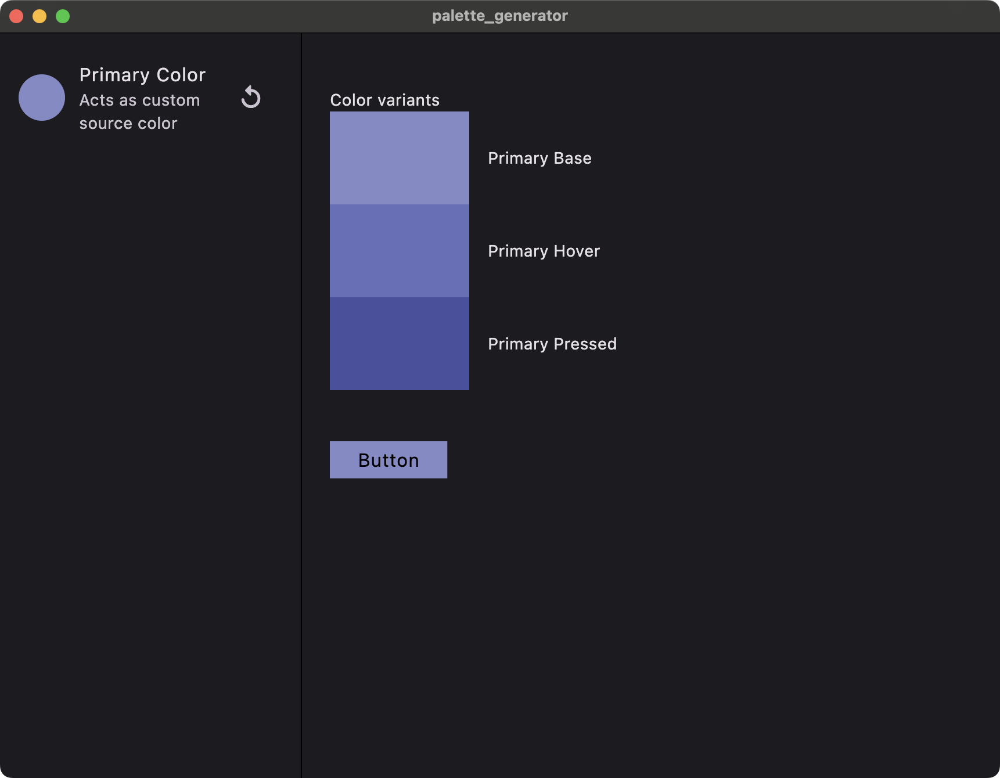

# palette_generator

Showcase how you can generate the whole palette just with one primary color, including hover and press tones.

Like that

## License

I found everything I needed for this app on the internet, so feel free to use this code as inspiration for your project.